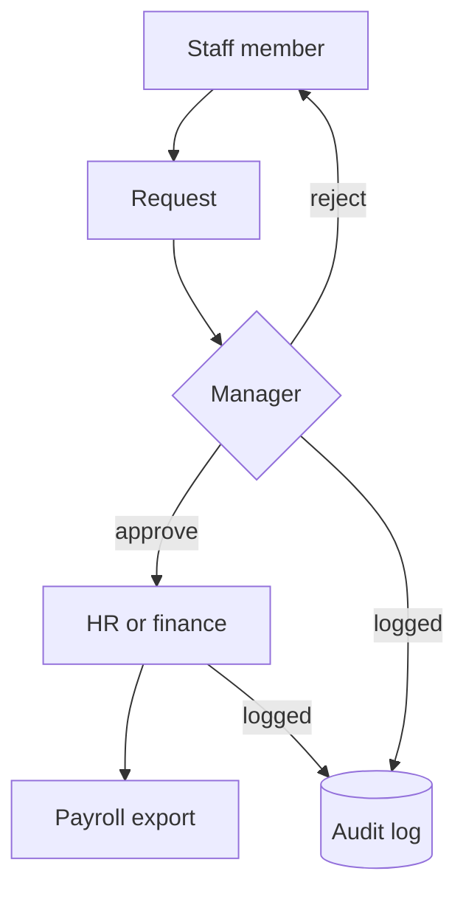

<b>Attendance, leave, overtime and approvals for our field staff, in Arabic and English</b>

نظام الموارد البشرية في مؤسسة ومن الماء حياة: الحضور والإجازات وساعات العمل الإضافية والموافقات

<b>Status:</b> In production use &nbsp;·&nbsp; <b>Built by</b> <a href="https://github.com/Mohanad1st">Mohannad Hesham</a>

> This is a case study. The source is private because it holds real staff records.

## Why we built it

Our staff work across offices and field sites. Check-ins, leave, overtime and expense approvals used to be scattered across manual and ad-hoc tools. Attendance feeds payroll, so here accuracy and a clear record matter more than usual. We didn't want a commercial HR subscription. So we built our own.

## What it does

- Staff check in and out with a verified location, and see their own history.
- They ask for leave or overtime. A manager or HR approves or rejects it, with a comment.
- Expense requests go through the department, then finance. Each one prints.
- HR decides who sees which module.
- Attendance, overtime and leave export to our payroll process. A separate page flags unusual attendance.

## How it works

Screens aren&#x27;t shown because every screen displays real staff records.

## What it's built on

React · Tailwind CSS · Python (FastAPI) · PostgreSQL · managed auth and storage · serverless hosting

## Safeguards

- Roles for staff, managers and HR. Finance approval is limited to named finance staff.
- Approvals and admin actions go into an audit log (one gap is still being closed).
- Backend tests run on every change to the main branch. There are no frontend tests yet.
- Arabic and right-to-left layout throughout.

## What's not solved yet

- Some payroll checks are still open. "In production" means staff rely on it now, not that it's finished.

## What it doesn't do

- It doesn't run payroll. It exports the data payroll is processed from.

## More from Life From Water

- [Ameen](https://github.com/Mohanad1st/ameen-showcase) — A finance desk you talk to, built to stop donation money being misfiled
- [WaterEye](https://github.com/Mohanad1st/watereye-showcase) — Read an analogue pressure or flow gauge from a photo, with no smart meter
- [Life From Water: donation platform](https://github.com/Mohanad1st/lifefromwater-website-showcase) — A donation platform in the making, with impact you can check, for our water-access work in rural Egypt
- [Opportunity Studio](https://github.com/Mohanad1st/opportunity-studio-showcase) — An evidence-first pipeline for grants, fellowships and tenders

---

© 2026 Mohannad Hesham. Showcase text and images only — no source code is published or licensed here. See all my work on <a href="https://github.com/Mohanad1st">my GitHub profile</a> · <a href="https://www.linkedin.com/in/mohannadhesham/">LinkedIn</a>.
