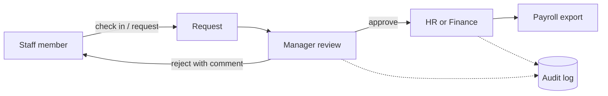

<b>Status:</b> In production use &nbsp;·&nbsp; <b>Built by</b> <a href="https://github.com/Mohanad1st">Mohannad Hesham</a> &nbsp;·&nbsp; <b>Source:</b> private

نظام الموارد البشرية: الحضور والإجازات والعمل الإضافي والموافقات

> **This is a showcase, not the code.** The source is private because it holds real staff records. This page shows what it does and how it was built, not the code itself. A live walkthrough is available on request.

## The problem

Life From Water's staff work across offices and field sites. Clocking in, requesting leave or overtime, and getting expense requests approved used to happen over messages and paper — and because attendance feeds payroll, a lost record costs someone real money. This system replaced that with one bilingual place for the whole flow, without paying for a commercial HR subscription.

## What it does

- Staff check in and out, with location verification, and see their own attendance history
- Leave and overtime requests that managers and HR approve or reject with comments
- Expense and finance requests routed through department and finance approval, with printable request views
- HR manages people, roles and which modules each role can see
- Exports that feed payroll, and a page that flags attendance anomalies
- An audit log of approvals and administrative actions

## See it

How the work flows:

Screens are not shown because every screen displays real staff records.

## Built with

React · Tailwind CSS · Python (FastAPI) · PostgreSQL · managed auth and storage · serverless hosting

## Built responsibly

- Role-based access for staff, managers and HR, with a separate finance approval path
- Approvals and admin actions are recorded in an audit log
- Automated backend tests run on every change
- Full Arabic and right-to-left layout, with documentation kept in both languages

## What it deliberately doesn't do

- It does not run payroll itself. It produces reviewed exports that payroll is processed from.

## More from Life From Water

- [Ameen](https://github.com/Mohanad1st/ameen-showcase) — A finance desk you talk to, built to stop donation money being misfiled
- [Life From Water — donation platform](https://github.com/Mohanad1st/lifefromwater-website-showcase) — Donations and impact you can check, for a water-access NGO in rural Egypt
- [Opportunity Studio](https://github.com/Mohanad1st/opportunity-studio-showcase) — An evidence-first pipeline for grants, fellowships and tenders

---

© 2026 Mohannad Hesham. Showcase text and images only — no source code is published or licensed here. See all my work on <a href="https://github.com/Mohanad1st">my GitHub profile</a> · <a href="https://www.linkedin.com/in/mohannadhesham/">LinkedIn</a>.
